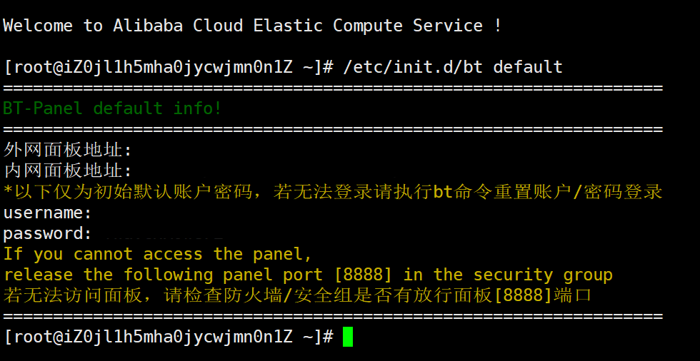
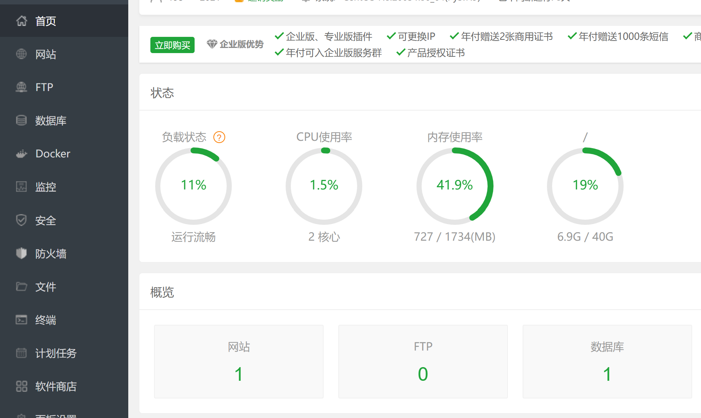
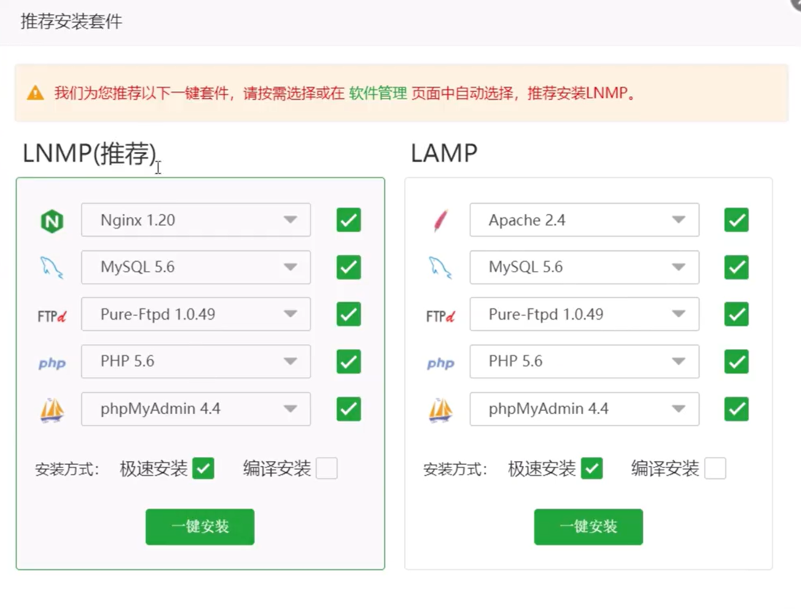
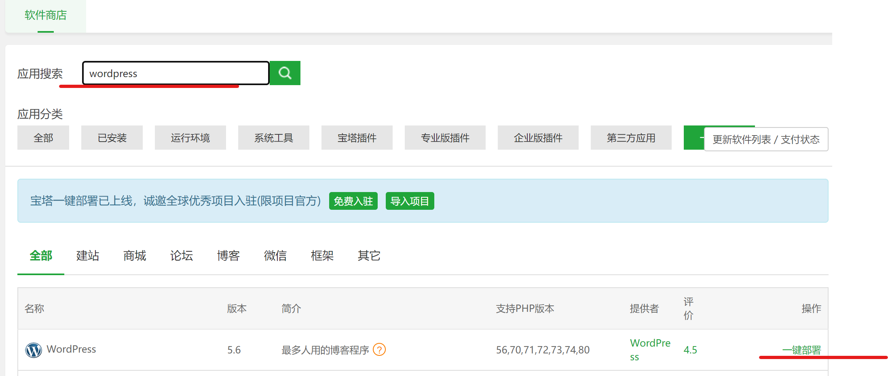
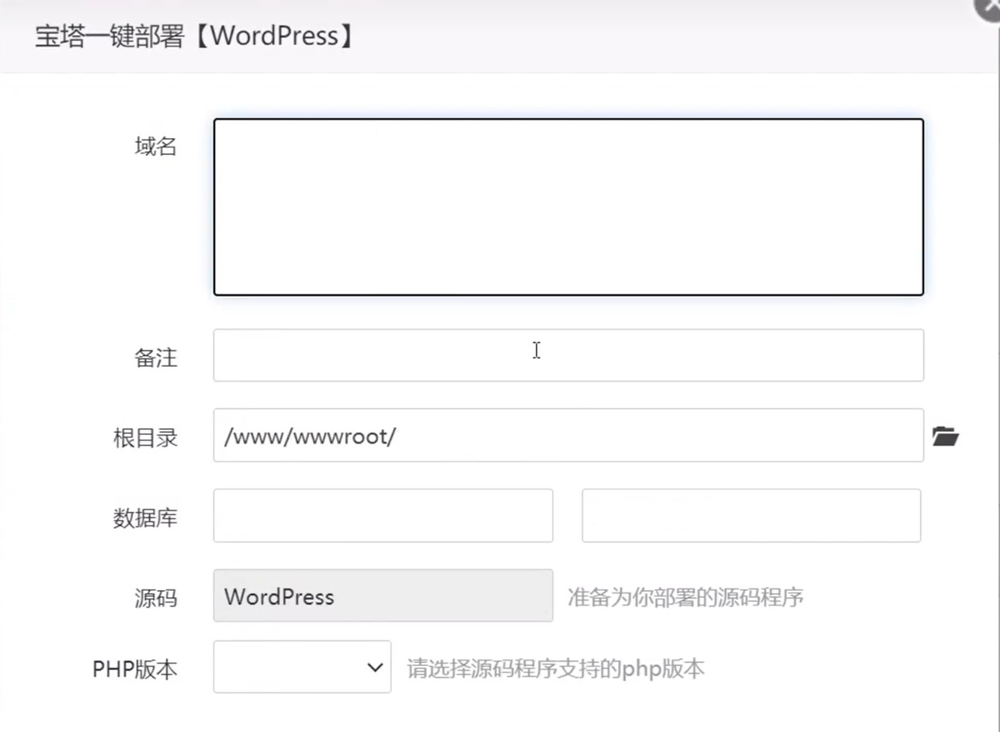
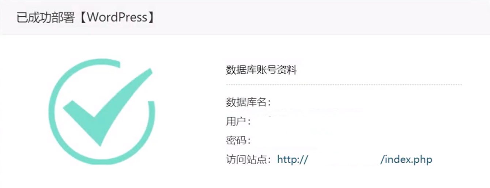
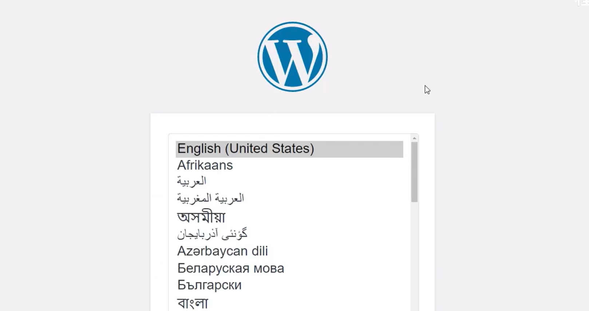
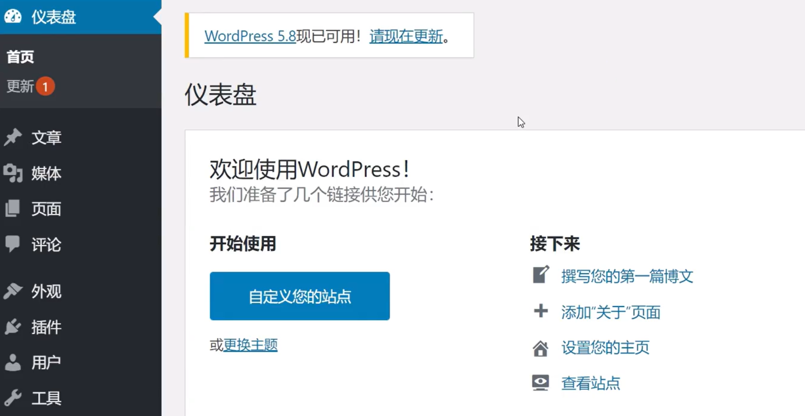

> 现在开发网站可比以前容易的多了，只要在电脑上点点几下，你就能拥有一台自己的服务器，这里我选择阿里服务器。主要用的是宝塔+wordpress，甚至你不需要写一行代码，就能拥有自己的个人网站。

## 安装宝塔

首先使用SSH远程连接到服务器，再输入以下指令即可。
`yum install -y wget && wget -O install.sh http://download.bt.cn/install/install_6.0.sh && sh install.sh ed8484bec`
注意我使用的系统是centos7，其他系统请查看官网链接[宝塔面板下载，免费全能的服务器运维软件 (bt.cn)](https://www.bt.cn/new/download.html)

安装成功后会有以下信息，然后根据提示输入网址及用户密码就可以登录宝塔面板啦😘

之后你会看到安装在云服务器上的宝塔面板，有关于你服务器的各种信息。

初次进入面板会提示安装套件，建议选择编译安装，php建议选高一点，比如php7.4，对wordpress兼容性好。

## 安装wordpress

在软件商店里搜寻wordpress，选择一键部署。

然后输入你的域名即可。记住数据库名称和密码，不记也没关系，可在宝塔面板-数据库-查看密码中找到。

之后会出现以下弹窗，点击访问站点即可

最后根据提示安装即可。

last but not least，我们的网站就建好了，点击查看站点。你就可以看到你的网站了。

