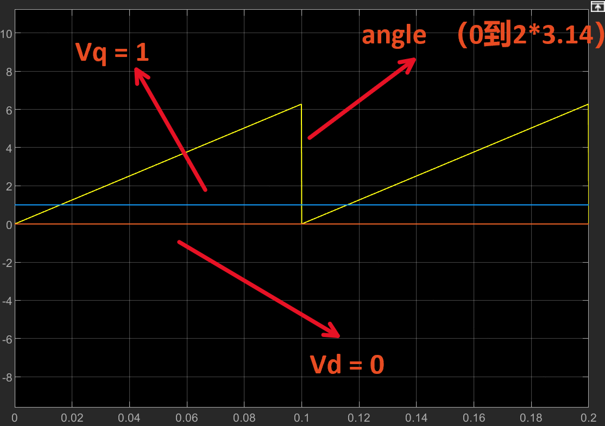
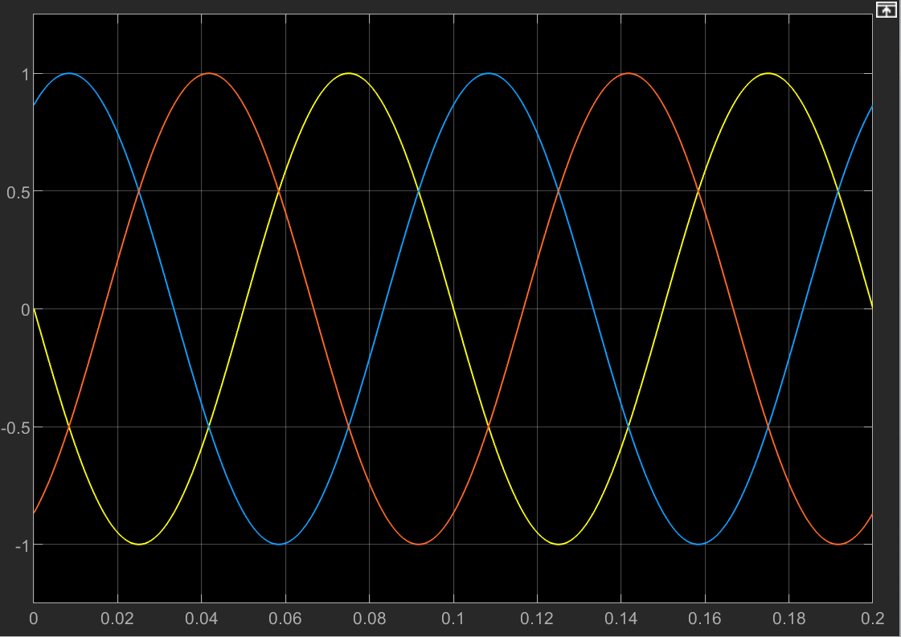
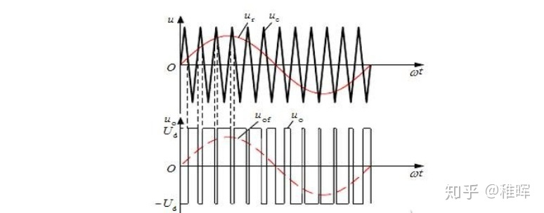

“learning foc”


# 代码

```c
int Vd = 0;
int Vq = 1;
float theta = 0.0;
float Valpha = 0.0;
float Vbeta = 0.0;
float out1 = 0.0;
float out2 = 0.0;
float out3 = 0.0;
```


```c
  while (1)
  {
      theta = angle;

      Valpha = Vd * cos(theta) - Vq * sin(theta);
      Vbeta = Vd * sin(theta) + Vq * cos(theta);

      out1 = Valpha;
      out2 = (-Valpha + Vbeta * sqrt(3)) / 2;
      out3 = (-Valpha - Vbeta * sqrt(3)) / 2;
      //上面是为了产生三相正弦波

      TIM3->CCR1 = ((out1 + 1) / 2) * 1000;
      TIM3->CCR2 = ((out2 + 1) / 2) * 1000;
      TIM3->CCR3 = ((out3 + 1) / 2) * 1000;
//这是调制pwm

  /* USER CODE END WHILE */

  /* USER CODE BEGIN 3 */
  }

```


```c
void HAL_TIM_PeriodElapsedCallback(TIM_HandleTypeDef *htim)
{

    if (htim == (&htim5))
    {
		angle +=0.1;
        if (angle > 3.1415926*2)
            angle = 0;
    }
}
```


# 代码解释

- 首先单片机开三个pwm输出引脚。
- angle 变量放在一个定时器中断里面。从0到2Π递增，到2Π归零。产生锯齿波形。锯齿波形的周期越短，得出的三相正弦波周期越短。电机转速越快。想要改变转速即改变中断的频率，即对应定时器ARR的值。==ARR越大电机转的越慢.==
- 后面的数学运算都是为了将Vd，Vq，angle，变成三相正弦波。控制这三个参数改变正弦波的周期，幅值。用到反park变换，反clark变换等。
- 最后是将产生的三相正弦波，调制成pwm波。


# 图像说明

**Vq  Vd  angle  的图像：**





**三相正弦波图像：**





**pwm调制：**





# 资料链接

[【自制FOC驱动器】深入浅出讲解FOC算法与SVPWM技术 - 知乎 (zhihu.com)](https://zhuanlan.zhihu.com/p/147659820)


[FOC视频教程_哔哩哔哩_bilibili](https://www.bilibili.com/video/av460113151?from=search&seid=11353541249577115434&spm_id_from=333.337.0.0)


[彻底搞懂两电平SVPWM调制原理及其仿真_哔哩哔哩_bilibili](https://www.bilibili.com/video/BV1o3411b7j7?spm_id_from=333.999.0.0)
