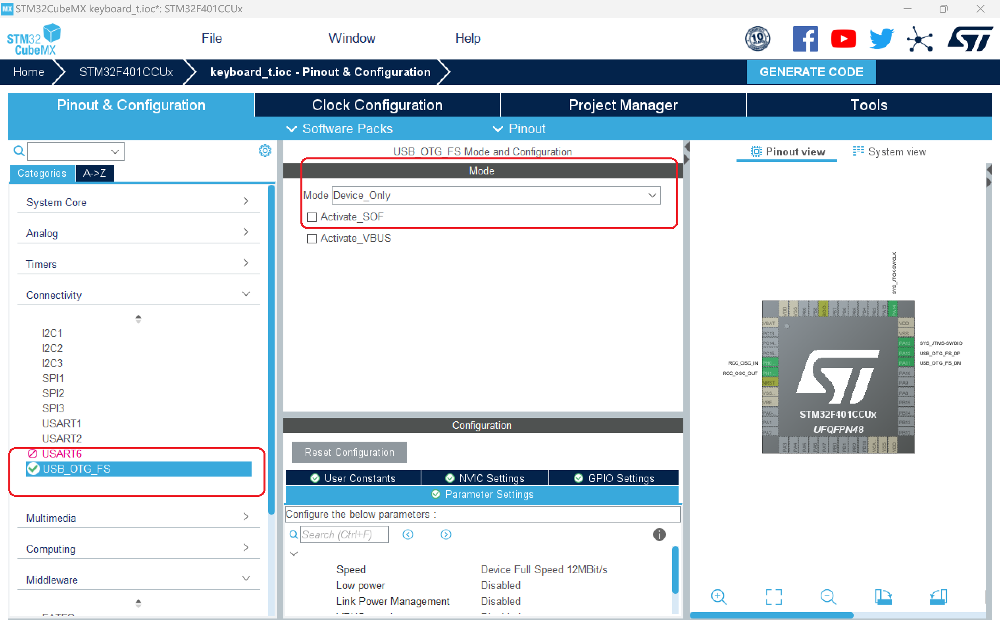
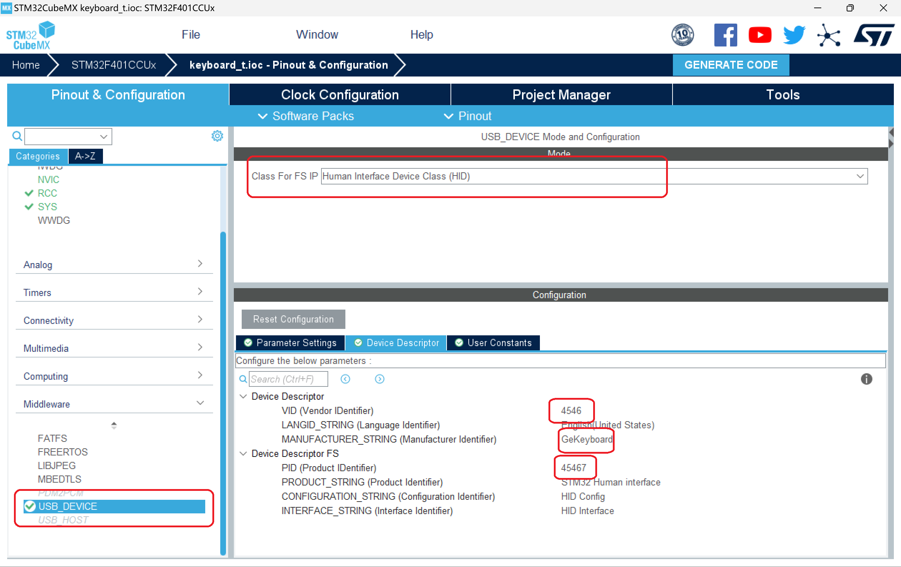
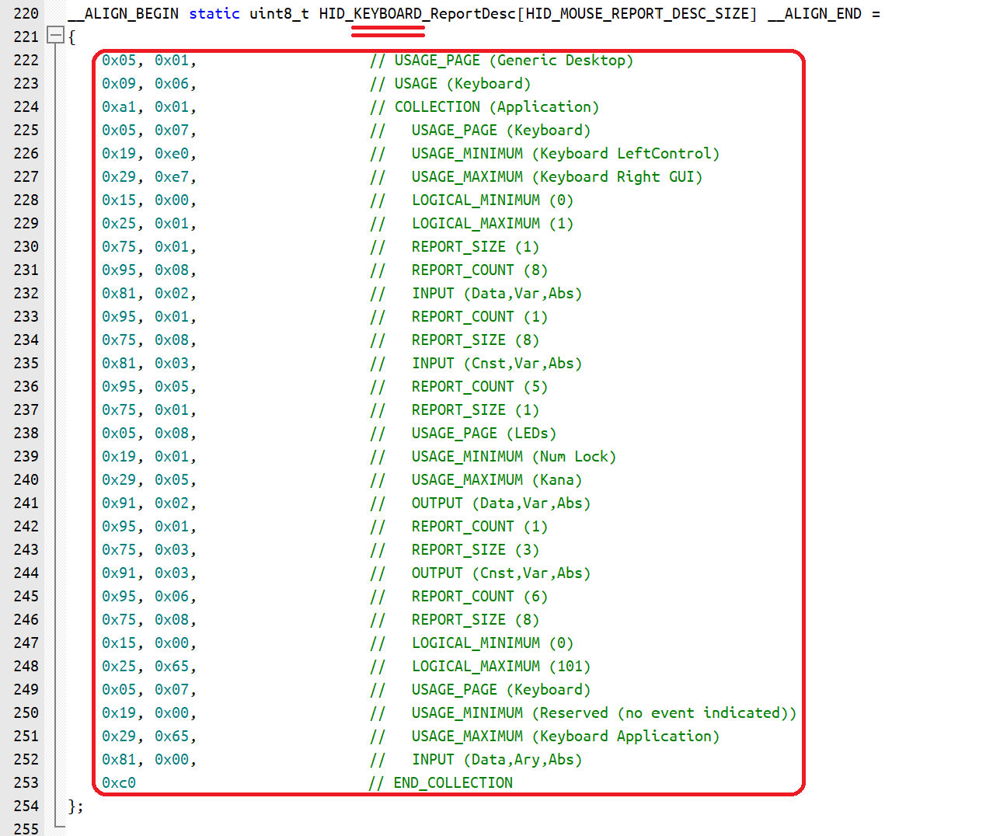
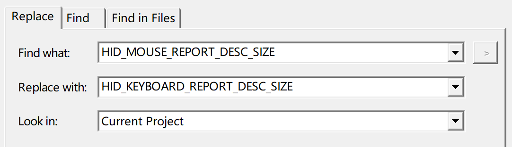
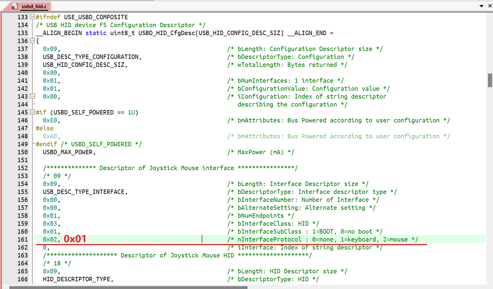
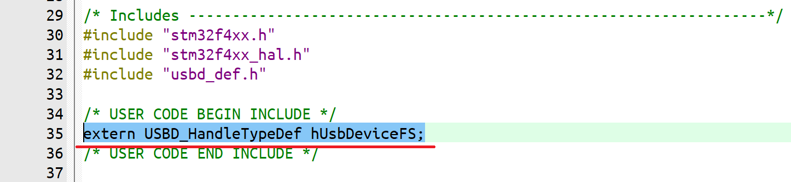
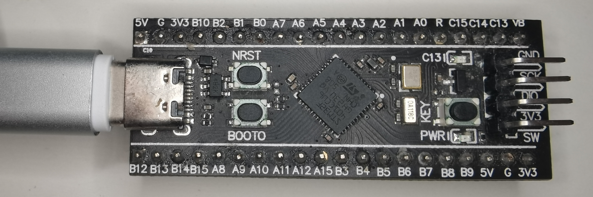

> 首先键盘使用的主控是stm32f401CCU6，开发方式为cubemx+keil。键盘主要采用的是USB HID+矩阵键盘扫描，灯光部分使用的是ws2812。此教程适合有一定stm32基础的人。


##Cubemx配置


- 首先用cubemx新建一个工程
- 选择USB_OTG_FS(有的芯片是USB)
- mode里选择Device_Only



- 然后Middleware里选择USB_DEVICE
- Class For FS IP 里选择Human Interface Device Class(HID)
- 其中VID和PID可以改成任意你喜欢的值，MANUFACTURER_STRING改成任意你喜欢的值
- 最后生成代码



## keil配置

- 打开usb_hid.c文件
- 在文件中搜索`HID_MOUSE_ReportDesc`（ctrl+f）
- 因为cubemx默认是生成鼠标报告描述符，所以要将其替换为键盘报告描述符
- 所以将鼠标描述符**内容**替换成以下键盘报告描述符**内容**即可


```c
char ReportDescriptor[63] = {
    0x05, 0x01,                    // USAGE_PAGE (Generic Desktop)
    0x09, 0x06,                    // USAGE (Keyboard)
    0xa1, 0x01,                    // COLLECTION (Application)
    0x05, 0x07,                    //   USAGE_PAGE (Keyboard)
    0x19, 0xe0,                    //   USAGE_MINIMUM (Keyboard LeftControl)
    0x29, 0xe7,                    //   USAGE_MAXIMUM (Keyboard Right GUI)
    0x15, 0x00,                    //   LOGICAL_MINIMUM (0)
    0x25, 0x01,                    //   LOGICAL_MAXIMUM (1)
    0x75, 0x01,                    //   REPORT_SIZE (1)
    0x95, 0x08,                    //   REPORT_COUNT (8)
    0x81, 0x02,                    //   INPUT (Data,Var,Abs)
    0x95, 0x01,                    //   REPORT_COUNT (1)
    0x75, 0x08,                    //   REPORT_SIZE (8)
    0x81, 0x03,                    //   INPUT (Cnst,Var,Abs)
    0x95, 0x05,                    //   REPORT_COUNT (5)
    0x75, 0x01,                    //   REPORT_SIZE (1)
    0x05, 0x08,                    //   USAGE_PAGE (LEDs)
    0x19, 0x01,                    //   USAGE_MINIMUM (Num Lock)
    0x29, 0x05,                    //   USAGE_MAXIMUM (Kana)
    0x91, 0x02,                    //   OUTPUT (Data,Var,Abs)
    0x95, 0x01,                    //   REPORT_COUNT (1)
    0x75, 0x03,                    //   REPORT_SIZE (3)
    0x91, 0x03,                    //   OUTPUT (Cnst,Var,Abs)
    0x95, 0x06,                    //   REPORT_COUNT (6)
    0x75, 0x08,                    //   REPORT_SIZE (8)
    0x15, 0x00,                    //   LOGICAL_MINIMUM (0)
    0x25, 0x65,                    //   LOGICAL_MAXIMUM (101)
    0x05, 0x07,                    //   USAGE_PAGE (Keyboard)
    0x19, 0x00,                    //   USAGE_MINIMUM (Reserved (no event indicated))
    0x29, 0x65,                    //   USAGE_MAXIMUM (Keyboard Application)
    0x81, 0x00,                    //   INPUT (Data,Ary,Abs)
    0xc0                           // END_COLLECTION
};
```


- 然后将**所有的**`HID_MOUSE_ReportDesc`改为`HID_KEYBOARD_ReportDesc`（ctrl+h）


**如下图所示：**



- 打开usbd_hid.h文件
- 找到`#define HID_MOUSE_REPORT_DESC_SIZE    74U`（ctrl+f）替换为
`#define HID_KEYBOARD_REPORT_DESC_SIZE    63U`
- 将**所有文件中**的`HID_MOUSE_REPORT_DESC_SIZE`替换为`HID_KEYBOARD_REPORT_DESC_SIZE`（ctrl+h）



- 然后找到红线那一行，0x02改为0x01，注释里说了1为键盘



- 打开usb_device.h文件添加一行`extern USBD_HandleTypeDef hUsbDeviceFS;`



- 在main.c添加头文件**#include “usbd_hid.h”**及以下试验代码


```c
 /* USER CODE BEGIN 2 */
uint8_t report[8]={0};
 /* USER CODE END 2 */

 /* Infinite loop */
 /* USER CODE BEGIN WHILE */
 while (1)
 {
 	HAL_Delay(2000);
	report[2] = 4;
	USBD_HID_SendReport(&hUsbDeviceFS,report,8);
	HAL_Delay(20);
	report[2] = 0;
	USBD_HID_SendReport(&hUsbDeviceFS,report,8);
	HAL_Delay(1000);
   /* USER CODE END WHILE */

   /* USER CODE BEGIN 3 */
 }
```


- 编译烧录
- 打开记事本
- stm32通过type-c连接至电脑。



- 两秒钟后不断打印aaaa…则配置成功🥳


##未完待续。。。
