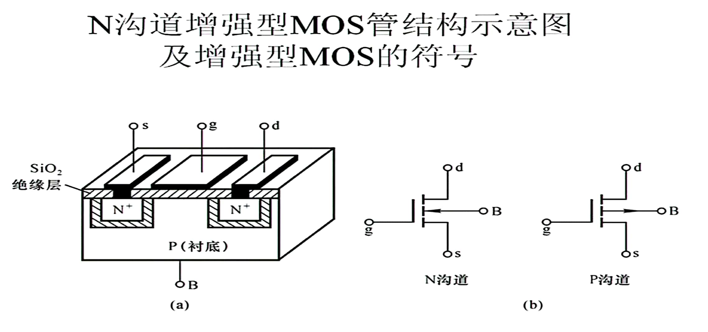
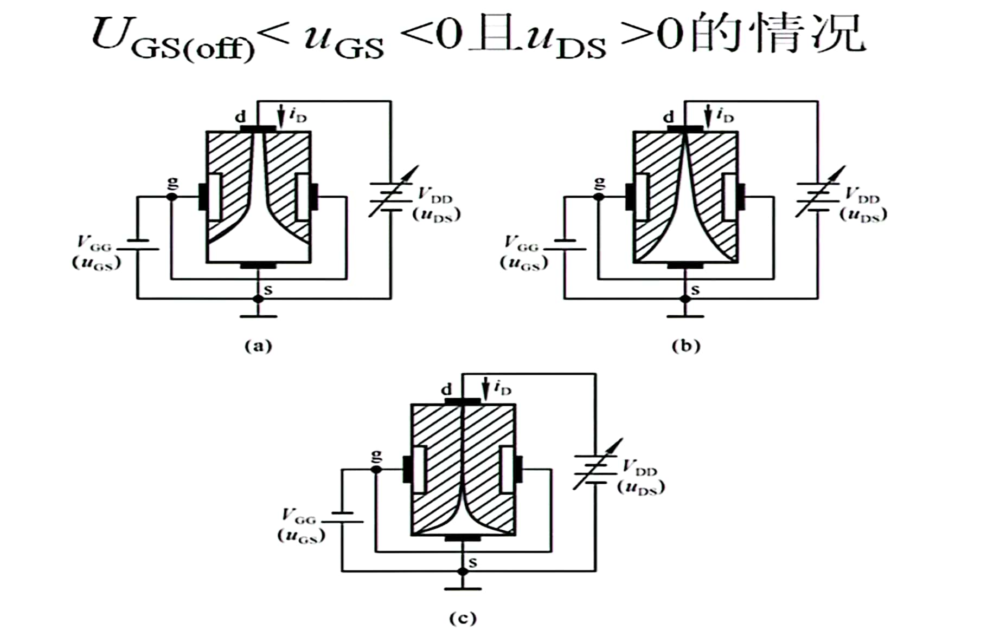
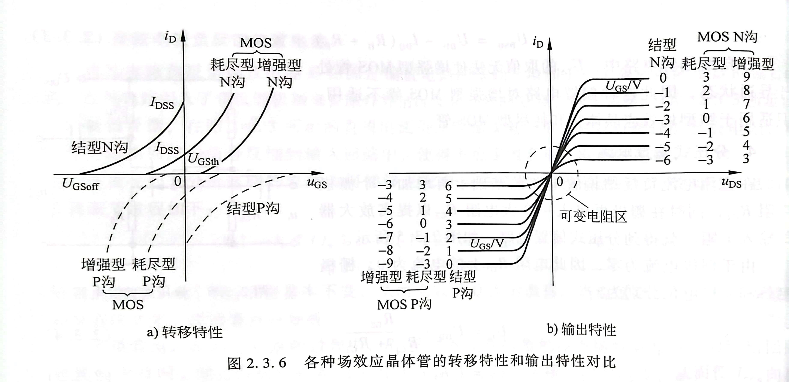
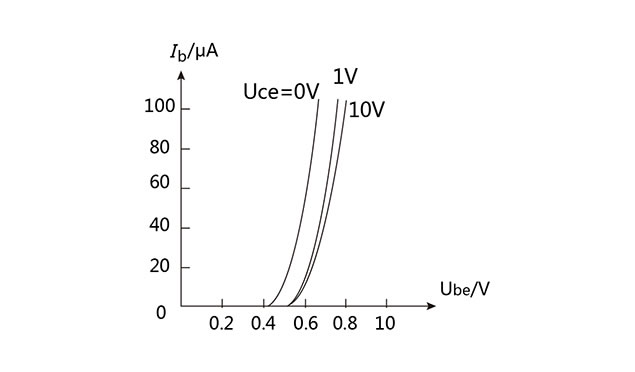
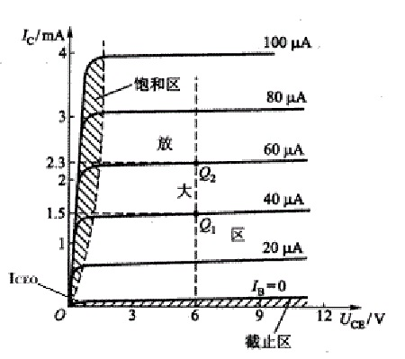
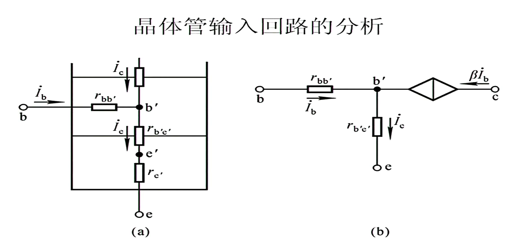

# 信号与系统

**线性系统：**输入的线性组合产生响应的线性组合
变换就是一个系统
$y_{zs}$   $zs$ = zero status
$y_{zi}$   $zi$ = zero input

完全响应：$y(\cdot)=T[{f(\cdot)},{x(0)}] $
零状态响应：$y(\cdot)=T[{f(\cdot)},{0}]$
零输入响应：$y(\cdot)=T[{0},{x(0)}] $

时不变系统：系统输入延迟多少时间，其零状态响应也相应延迟多少时间。（不考虑$x(0)$）

# 模拟电路

## 预备知识

**电容元件定义**：一个二端元件，在任意时期$t$，它所积累的电荷$q(t)$与端电压$u(t)$之间的关系可以用$q$-$u$平面上的一条曲线来确定，则称该二端元件为电容元件，简称电容。

**电容的单位**为法拉，简称法，符号为$F$

电容元件电流不取决与该时刻电容电压的大小，而取决于该时刻的电容电压的变化率，所以电容元件称为动态元件。

电容微分形式$VCR:$      $i=C\frac {du}{dt}$

电容电压只能连续变化而不能发生跳变，这说明电容电压只能是时间$t$的连续函数，这种性质称为电容的惯性，电容元件也称为惯性元件。

电容积分形式$VCR:$       $u(t)=\frac 1C\int^t _{-\infty}i(\xi)d\xi$

任意时刻$t$电容电压并不取决于该时刻的电流值，而是取决于$-\infty$到$t$所有的时刻的电流值，即与$t$以前电容电流的全部历史有关。电容电压能反映又去电流作用的全部历史，因此可以说电容电压有“记忆”电流的作用。电容是一种“记忆元件”

电容元件是一个储能元件而不是耗能元件。

**叠加定理：**对于具有唯一解的线性电路，如果有多个独立源同时作用，则电路中任一响应（电流或电压）等于各个独立源单独作用（其他独立源置零）时在该处所产生的分响应（电流或电压）的代数和。
**齐次性定理：**在线性电阻电路中，若电路只有一个激励（独立电压源或独立电流源）作用，则电路中的任意响应（电压或电流）和激励成正比；若电路中含有多个激励，则当所有激励（独立电压源或独立电流源）都同时增大或缩小$k$倍时（$k$为任意实常数），电路响应也将相应增大或缩小$k$倍。
**戴维南定理：**任意一个线性有源二端网络，就其输入端而言总可与一个独立电压源和一个线性电阻串联的电路等效。其中独立电压源的电压等于该二端网络输出端的开路电压$u_{oc}$；串联电阻$R_0$等于将该二端网络内所有独立源置零时输出端的等效电阻。

非线性电阻的串、并联运算可以使用解析法或图解法来实现。

## 双极晶体管（三极管）

$B:base$基极
$E:emission$发射极，发射载流子的
$C:collection $集电极

$i_B$：直流和交流都存在的瞬时值
$I_B$：直流
$\dot I_b$：正弦交流量的向量
$i_b$：（正弦）交流分量
$I_b$：正弦交流量的有效值

三极管→：由P→N，发射结导通的方向

发射区：重参杂

N型半导体：也称为电子型半导体。N型半导体即**自由电子**浓度远大于**空穴**浓度的杂质半导体。

发射结：基区与发射区形 成的结
集电结：基区与集电区形成的结
发射结正偏

## N/P沟道增强型绝缘栅型场效应管（MOS管）

$g:grid$栅极
$s:source$源极
$d:drain$漏极

## N沟道结型场效应管

## 场效应管参数

1. 直流参数：$U_{GS(th)}$   $U_{GS(off)}$   $I_{DSS}$   $R_{GS(DC)}$
2. 交流参数：
- 跨导（低频）$g_m=\frac{\Delta i_D}{\Delta U_{GS}}|*{U*{DS}=常数}$
- 极间电容

## $BJT$共射特性曲线

1. 输入特性曲线

$i_c=f(u_{BE})$       $U_{CE}=常数$

1. 输出特性曲线
$i_c=f(u_{CE})$       $i_B=常数$

**虽然内部根据电压原则集电极处于正偏状态，但集电结内电子流动属性不是按照正偏二极管方向，而是依然按照三极管集电结扩散运动方向**

直接耦合共射放大电路
阻容耦合共射放大电路

**共射电流放大系数：**
$$
\overline\beta = \frac {I_{CN}}{I_{BN}}=\frac{I_C-I_{CBO}}{I_B+I_{CBO}}\approx\frac {I_c}{I_B}
$$

$$
\beta=\frac {\Delta {I_C}}{\Delta {I_B}}
$$

穿透电流：$I_{CEO}$
**共基电流放大系数：**
$$
\overline\alpha=\frac {I_C}{I_E}=\frac{\overline\beta}{1+\overline\beta}
$$

- $PN$结每升高一度，正向导通压降小$2$~ $2.5mv$，反向导通，每十度翻一倍。
- 温度升高，$\beta$增大

## 放大电路的性能指标

1. **放大倍数：$A_{uu}$    $A_{ui}$    $A_{iu}$    $A_{ii}$**
2. **$R_i$放大电路的输入等效电阻，越大越好**
3. **$R_o$放大电路的输出等效电阻**
4. 通频带，放大电路的工作频率
5. 非线性失真
6. 最大不失真输出电压
7. 最大输出功率与效率

## 放大电路的分析方法

**直流通路**
$u_i=0$

**交流通路**

1. 直流源置0
2. 电容→短路

等效电路法

1. Q点
2. $r_{be}=r_{bb’}+(1+\beta)\frac {U_{T}}{I_{EQ}}$

给出$U_{BEQ}$相当于在二极管中给出了开通电压
$rbb’$代表基区体电阻

## 解题思路

- 静态
- 直流通路
- $V_{CC}=U_{BEQ}+I_{BQ}\cdot R_B$
- $I_{EQ}=(1+\beta)I_{BQ}$
- $→I_{EQ}=?$
- 动态
- 交流通路
- (简化)h参数等效
- $A_u=\frac {u_0}{u_i}=\frac {-ic\cdot R_L\parallel R_C}{i_b \cdot r_{be}}=\frac{-\beta\cdot R_L\parallel R_C}{r_{be}} $
- $R_i=R_B\parallel r_{be}$

$R_0$越小输出端越近似于电压源
$R_0$越大输出端越近似于电流源
